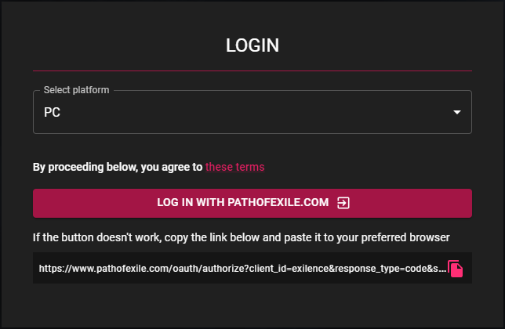
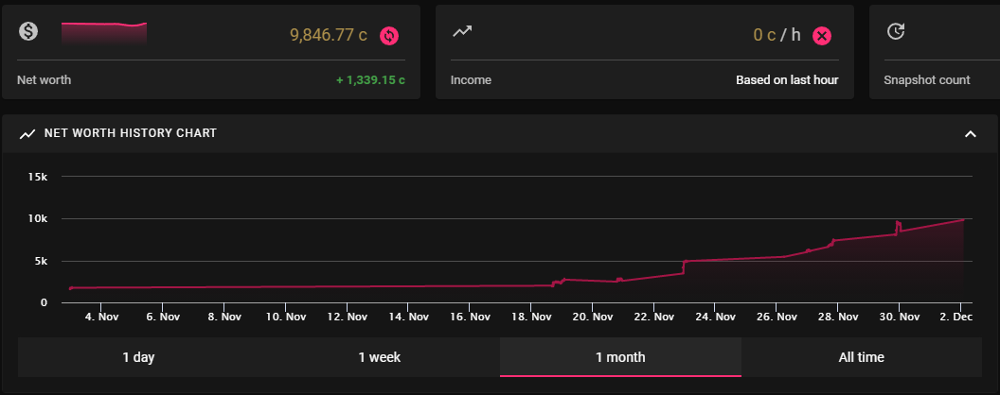

Exilence Next is an app that lets you track your income and net worth in Path of Exile based off the items in your stash.

<!--more-->

- [Exilence Next](#exilence-next)
- [Exilence is Always Useful](#exilence-is-always-useful)

## Exilence Next

Download and install the latest stable version of the program from the [developer's github page](https://github.com/viktorgullmark/exilence-next/releases/latest).

The program has an account integration function to get started quickly.

Log into your Path of Exile account and Authorize Exilence access to view your stashes and items.

## Exilence is Always Useful

Newer players will find Exilence's break down of individual currency conversions helpful in understanding the combined value of smaller currencies.

Exilence tracks and provides a chaos orb value for the selected stash tabs at regular intervals.

Having a visual representation of wealth is one reason many players enjoy Path of Exile.

Once you begin currency making strategies, the currency per hour function helps track efficiency.
