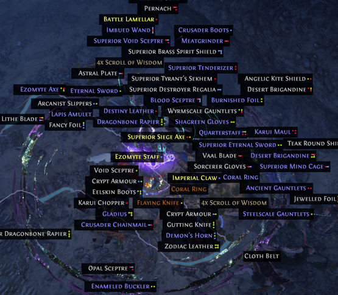
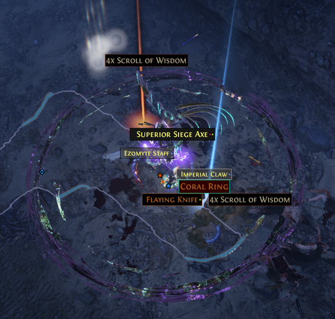

Loot filters allow you to decrease the amount of items that appear on the ground for you to click. 
This increases in-game efficiency with less time spent looking at low-value items.

<!--more-->

## NeverSink Loot Filters

The most popular loot filters used in the game are created by NeverSink and can be found on [his PathofExile profile](https://www.pathofexile.com/account/view-profile/NeverSink/item-filters). At the top-right corner of the filters you'd like to use, select **FOLLOW**.

The filters will populate when you login to the game under the **Game** options sub-menu.

The **semi-strict** level filter is the recommended item filter for newer players. 

This is the loot from one pack of mobs without a loot filter:

This is the same loot with the semi-strict loot filter applied:

Players can also hide filtered items from rendering as drops to in-game performance by a large margin.

The option can be found on the same **Game** options sub-menu.

### Customizing Loot Filters

NeverSink, the creator of the most-popular loot filters, has a public website for players to customize loot filters as they wish.

The website is called [FilterBlade](https://www.filterblade.xyz/) and provides a wide variety of customization from colors palettes to new drop sounds.

If the default filters don't match the colors you'd like to see in-game, feel free to customize them to your liking!

//TODO: Add pictures of lootfilter in action.
