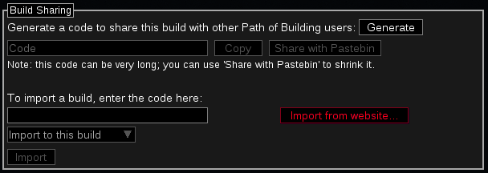
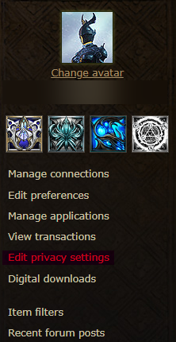
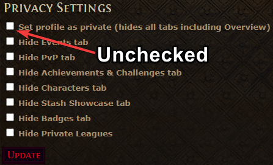
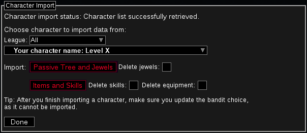

- [Installing PoB Community Fork](#installing-pob-community-fork)
- [Importing a Build from Pastebin](#importing-a-build-from-pastebin)
- [Importing Your Own Character](#importing-your-own-character)

Path of Building (PoB) is a tool that allows Path of Exile players to simulate the skill tree and in-game equipment to evaluate builds.

<!--more-->

## Installing PoB Community Fork

Note that the original Path of Building is no longer supported, and users must download and install the [Path of Building Community Fork](https://github.com/PathOfBuildingCommunity/PathOfBuilding/releases). It is recommended to use the Setup-x.exe for convenience.

Once downloaded, run the installer for the program.

## Importing a Build from Pastebin

Path of Building features the ability to import and export builds with ease via pastebin links. These pastebin links are safe and contain the string of characters that defines a build in PoB.

Open Path of Building and navigate to the top-left corner of the program. Select **Import/Export Build**.

There will be two sections here. For the purpose of this section, focus on the **Build Sharing** section on the bottom.

Select **Import from website...**

Then copy and paste a pastebin link with build information.

Select **Import** after confirming the pastebin link imported the build code.

## Importing Your Own Character

Path of Building allows convenient access to your own character's skill tree and their current equipment.

To begin, first make your Path of Exile account public.

Visit your Path of Exile [Account Info page](https://www.pathofexile.com/my-account) and login.

Select **Edit privacy settings** on the right-side of the page.

Uncheck **Set profile as private**. Confirm your change by selecting **Update**.

Back in Path of Building:
Under **Character Import** in the **Import/Export Build** screen, enter your Path of Exile account name and select **Start**.

The program will retrieve a list of your characters for you to select.
Once you have confirmed the character whose information you'd like to import, click both **Passive Tree and Jewels** and **Items and Skills**.

Click **done** once you have finished.
