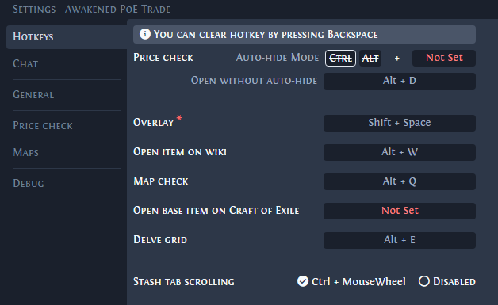

Trade macros are external tools that allow players to check item values and trade for items with other players more easily.

<!--more-->
- [Awakened PoE Trade](#awakened-poe-trade)
  - [Common default hotkeys](#common-default-hotkeys)

## Awakened PoE Trade

[Awakened PoE Trade](https://snosme.github.io/awakened-poe-trade/download) is a third-party tool that can be downloaded and installed for both Windows and Linux. It features a price checking function that uses real-time data and predictions to give players an estimate of item value.

The tool updates automatically if you use the installer on Windows.

Run the game in Windowed or Windowed-Fullscreen mode for the program to function properly.

- Pressing `Shift+Space` will open the tool's in-game overlay where you'll find the settings.

  - You can change or assign new hotkeys from within the in-game overlay.

  - Below is an example of a modified hotkey window within Awakened PoE Trade.
  

### Common default hotkeys

- Pressing `Ctrl+D` while hovering over an item will allow you to price check the item.

  - The price check window will close automatically if your cursor stops hovering over the item.

- Pressing `Ctrl+Alt+D` will allow you to price check an item and modify parameters without the window closing.

- Pressing `F5` will send the `/hideout` command if your character is in a town or another player's hideout.
  